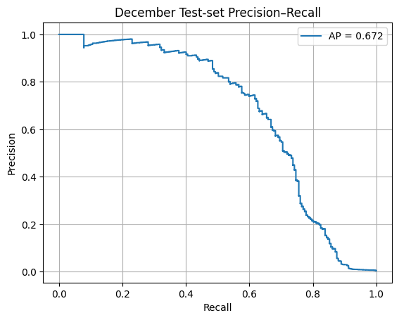
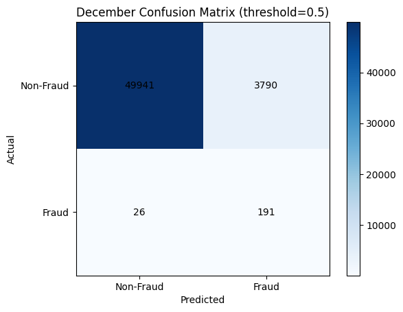

## Introduction

As digital payments become the norm, payment-card fraud remains a persistent threat—rare in occurrence but costly in impact. Every minute, thousands of transactions flow through online platforms and point-of-sale terminals, and behind the scenes, fraudsters test stolen card data in tiny bursts to evade simple rule-based filters. To stay ahead, we need models that can spot subtle, time-sensitive patterns in millions of transactions per day.

In this project, we tackle this challenge head-on with XGBoost, a powerful gradient-boosted tree algorithm. By engineering features that capture transaction timing, geography, and currency risk profiles, we build a real-time fraud detector that flags nearly nine out of ten fraudulent transactions while limiting false alarms to just 7 %. In the sections that follow, we’ll outline the problem, our modeling approach, and the key results that demonstrate XGBoost’s effectiveness under extreme class imbalance.

---

## Problem Statement

Our dataset contains **587 299 transactions**, of which only **1 393 (0.24 %)** are fraudulent—an extreme class imbalance. A trivial “always-legit” rule would be correct 99.76 % of the time but catch zero frauds. Yet every false positive inconveniences customers and strains operational workflows. We therefore need a model that can:

- **Maximize fraud recall**: catch as many fraudulent transactions as possible  
- **Minimize false positives**: allow legitimate transactions to proceed smoothly  
- **Operate in real time**: handle high transaction volumes with low latency  

---

## Evaluation Metric: Average Precision

In highly imbalanced settings like fraud detection, neither recall nor precision alone tells the full story:

- **High recall** alone can be “gamed” by flagging nearly every transaction as fraud, driving precision to near zero.  
- **High precision** alone can be achieved by flagging only a tiny handful of cases, missing most fraud and yielding low recall.

To capture the trade-off between these two, we optimize **Average Precision (AP)**—the area under the Precision–Recall curve as the decision threshold varies. AP has several advantages:

1. **Summarizes the full curve**: Instead of picking one threshold, AP aggregates precision at all recall levels.  
2. **Robust to class imbalance**: The baseline AP for a random ranker equals the fraud prevalence (≈0.4 %), making it easy to see improvement.  
3. **Directly reflects operational trade-offs**: A higher AP means the model can raise recall without precision collapsing.

On our held-out December set, the XGBoost model achieves an AP of **0.672**, far above the random baseline—demonstrating strong ranking ability under extreme imbalance.  

---

## Key Results

### Precision–Recall Curve

  

**Figure:** December test-set Precision–Recall curve (AP = 0.672).

- The curve climbs steeply at low recall, indicating the model ranks true frauds highly.  
- An AP of **0.672** greatly exceeds the random-ranking baseline (fraud prevalence ≈ 0.4 %), demonstrating strong discrimination under extreme imbalance.

---

### Confusion Matrix (Threshold = 0.5)

  

**Figure:** December confusion matrix at 0.5 decision threshold.

From this matrix:

- **Fraud recall** = 191 / (191 + 26) ≈ **88 %**  
- **False-positive rate** = 3 790 / (49 941 + 3 790) ≈ **7 %**

These results show the model catches nearly nine out of ten frauds while keeping false alarms to a manageable level—striking the right balance for real-time deployment.

---

## What Is Average Precision?

Neither recall nor precision alone gives the full picture:  
- **High recall** can be “gamed” by flagging almost every transaction as fraud, driving precision to zero.  
- **High precision** can be achieved by flagging only a handful of cases, missing most fraud and yielding low recall.  

Balancing these is critical: we want to catch as much fraud as possible (high recall) while keeping the review queue manageable (high precision).

Average Precision (AP) condenses the entire Precision–Recall curve into a single score. It is computed as the approximate area under the PR curve (e.g.\ via `average_precision_score(y_true, y_score)`). Concretely, if you plot precision \(P\) vs.\ recall \(R\) as you sweep the classification threshold, then

\[
\mathrm{AP} \;=\; \sum_{n=1}^{N}
  \bigl(R_{n} - R_{n-1}\bigr)\,\times\,P_{n},
\]

where each slice \((R_{n}-R_{n-1})\) is the incremental change in recall and \(P_{n}\) is the precision at that point.

- \(\mathrm{AP}\approx1.0\)  
  Precision stays at 1.0 for every recall level: the model ranks all frauds above all non-frauds, achieving perfect separation (no false positives even at 100 % recall).

- \(\mathrm{AP}\approx0.0\)  
  Precision collapses to (or near) zero as soon as you start flagging. Either you never catch any true fraud (\(\mathrm{TP}=0\)) or you immediately swamp your predictions with false alarms.

A random-ranking model (no discriminative power) yields an AP equal to the fraud prevalence (≈ 0.4 %). Our model’s AP of **0.672**—far above that baseline—shows it maintains high precision even as recall rises, demonstrating robust ranking performance under extreme class imbalance.  

---

If you're interested in exploring the full methodology and results, you can download the complete paper [here](./paper.pdf).