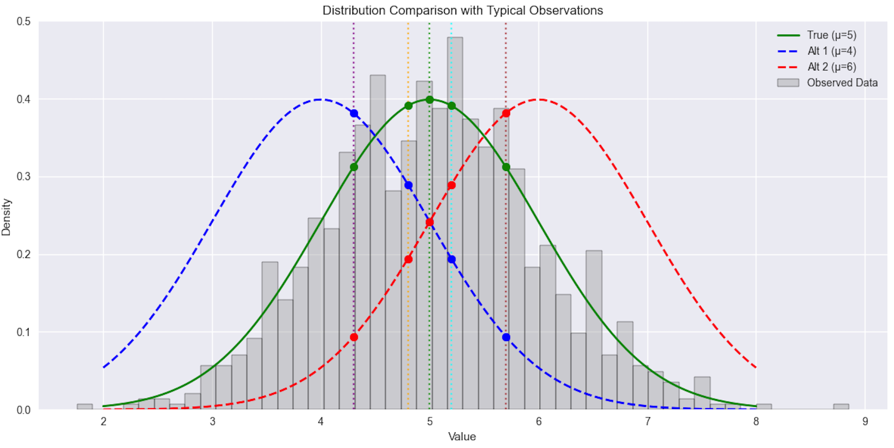

## Maximum Likelihood and Loss Functions: From Probability to Optimization

In machine learning, we often take loss functions for granted. Data scientists routinely use mean squared error for regression tasks and cross-entropy for classification problems, but have you ever wondered why these particular functions are chosen? Far from being arbitrary choices, these loss functions emerge naturally from fundamental principles of probability theory.

At the heart of this connection lies Maximum Likelihood Estimation (MLE), a powerful statistical principle that bridges the gap between probability theory and optimization. When we train a machine learning model by minimizing a loss function, we're often unknowingly performing maximum likelihood estimation under specific probabilistic assumptions about our data.

Understanding this connection provides practitioners with:
- Insight into when standard loss functions are appropriate and when they might need modification
- A deeper understanding of model assumptions and limitations
- Tools for better model interpretation and debugging

In this article, we'll uncover how commonly used loss functions naturally arise from maximum likelihood estimation. We'll walk through the derivation of both linear regression's mean squared error and logistic regression's cross-entropy loss, showing how they emerge from simple probabilistic assumptions about the data generation process.

## Maximum Likelihood Estimation

### Concept

Maximum Likelihood Estimation (MLE) is a fundamental method for finding the parameters of a probability distribution that best explains observed data. The key idea is simple: given a known type of distribution (like normal, exponential, etc.), MLE finds the specific parameters of that distribution that make our observed data most probable.

Think of it as "reverse engineering" the parameters: we see the data, we know the type of distribution that generated it, and we want to find the exact parameters that were most likely used to generate that data.

### Mathematical Foundation

#### Basic Formula

Given independent observations $x_1, x_2, \dots, x_n$ from a known distribution type, the likelihood function is:

$$
L(\theta) = P(x_1, x_2, \dots, x_n | \theta) = P(x_1 | \theta) \times P(x_2 | \theta) \times \dots \times P(x_n | \theta)
$$

where:
- $\theta$ represents the parameters we want to estimate
- The distribution type is known (e.g., normal, exponential)
- $P(x_i | \theta)$ is the probability of observing $x_i$ given parameters $\theta$

### Understanding MLE Through Visualization

    

#### Example Setup

In this example, we have data that follows a normal distribution with unknown parameters to be estimated. While the true parameters are $\mu=5$ and $\sigma=1$ (known here for demonstration), in practice these would be unknown. Let's compare three possible parameter choices, $\mu=5$, $\mu=4$, and $\mu=6$, all with the same standard deviation $\sigma=1$.

The gray histogram displays our observed data, which follows a normal distribution with $\mu=5$ and $\sigma=1$. Let's analyze the likelihood calculation for 5 representative points (4.3, 4.8, 5.0, 5.2, and 5.7):

##### Likelihood Values:

- $L(5) = 0.341 \times 0.391 \times 0.399 \times 0.391 \times 0.317 = 0.00532$ (true parameters)
- $L(4) = 0.386 \times 0.311 \times 0.242 \times 0.179 \times 0.066 = 0.00031$
- $L(6) = 0.066 \times 0.179 \times 0.242 \times 0.311 \times 0.386 = 0.00031$

The maximum likelihood occurs at $\mu=5$ because:
1. For a normal distribution, 68.27% of data points fall between $\mu \pm \sigma$ (4 to 6 in our case)
2. Our observed points mostly fall in this high-probability region
3. The true distribution ($\mu=5$) assigns consistently high probabilities to these typical values
4. Alternative distributions ($\mu=4$ or $\mu=6$) must assign very low probabilities to some points, leading to much lower likelihood values

## From MLE to Loss Functions

When we maximize likelihood, we can equivalently minimize its negative logarithm:

$$
\arg\max_\theta L(\theta) = \arg\min_\theta -\log(L(\theta))
$$

## Linear Regression: Deriving Mean Squared Error from Maximum Likelihood

### Model Assumption:
- $y = wx + b + \epsilon$, where $\epsilon$ is the error term
- $(y - wx - b)$ follows $N(0, \sigma^2)$
- This means our errors (residuals) follow a normal distribution

### Probabilistic Interpretation:
For each observation $(x_i, y_i)$:

$$
P(y_i | x_i, w, b) = \frac{1}{\sqrt{2\pi\sigma^2}} \exp\left(-\frac{(y_i - wx_i - b)^2}{2\sigma^2}\right)
$$

For $n$ independent observations:

$$
L(w, b) = \prod_{i=1}^{n} \frac{1}{\sqrt{2\pi\sigma^2}} \exp\left(-\frac{(y_i - wx_i - b)^2}{2\sigma^2}\right)
$$

Taking the negative log-likelihood:

$$
-\log(L) = \frac{n}{2}\log(2\pi\sigma^2) + \frac{1}{2\sigma^2}\sum_{i=1}^n (y_i - wx_i - b)^2
$$

Dropping constants and scaling factors:

$$
\arg\min_{w,b} -\log(L) \propto \arg\min_{w,b} \sum_{i=1}^n (y_i - wx_i - b)^2
$$

This is exactly the Mean Squared Error loss function!

## Logistic Regression: Deriving Cross-Entropy Loss

### Model Assumptions:
1. Binary classification: $y_i \in \{0,1\}$
2. Probability of class 1: $P(y=1|x) = \sigma(wx + b)$
3. Where $\sigma(z) = \frac{1}{1 + e^{-z}}$ is the sigmoid function

### Probabilistic Derivation:
For each observation $(x_i, y_i)$:

$$
P(y_i|x_i) = \sigma(wx_i + b)^{y_i}(1-\sigma(wx_i + b))^{1-y_i}
$$

For all observations:

$$
L(w,b) = \prod_{i=1}^n \sigma(wx_i + b)^{y_i}(1-\sigma(wx_i + b))^{1-y_i}
$$

Taking the negative log-likelihood:

$$
-\log(L) = -\sum_{i=1}^n [y_i\log(\sigma(wx_i + b)) + (1-y_i)\log(1-\sigma(wx_i + b))]
$$

This is the binary cross-entropy loss function!