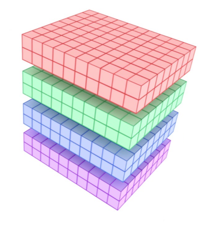

## Introduction

As computing technology advances, modern microprocessors are becoming more powerful, consuming up to 200 watts of power or more. This immense energy consumption generates significant heat, which, if not managed properly, can degrade the processor’s performance and reliability. To address this, heatsinks are crucial components designed to dissipate this heat, transferring it away from the processor into the heatsink itself, where it can be safely dispersed into the surrounding environment.

In this research, we focus on simulating the heat transfer dynamics within a CPU heatsink, specifically targeting the AMD EPYC "Rome" model. By parallelizing the simulation process, we aim to efficiently model the heat dissipation behavior across a complex grid structure, allowing for accurate predictions of temperature distributions within the heatsink. Through optimized computational strategies, we explore how to minimize simulation time while maintaining the accuracy of the thermal modeling.

In this article, we investigate several parallelization methods that distribute the workload across multiple processors, improving efficiency in large-scale simulations of heat transfer in CPU heatsinks.

---

## Approach

In our study, we implemented a parallelized simulation to model the heat transfer within a CPU heatsink, focusing on the AMD EPYC "Rome" processor. The simulation's core principle is to divide the heatsink into a 3D grid of cuboidal cells, each representing a discrete volume of the heatsink. This spatial discretization allows us to track temperature changes in each cell based on heat conduction between neighboring cells over time.

The key challenge is the computational cost of such simulations, especially when using finer grids for higher accuracy. To overcome this, we employed **parallelization** by dividing the heatsink grid into smaller subdomains, each assigned to a different processor. These processors then handle the computation for their respective subdomains simultaneously, significantly speeding up the simulation.

We explored two main parallelization techniques:

1. **1D Slicing (Z-axis slicing)**: In this method, the heatsink is sliced along the Z-axis, and each slice is assigned to a processor. This method offers simplicity but requires careful management of communication between processors, as each slice needs to exchange temperature data with its neighbors to ensure accuracy.

2. **2D Slicing (Z and Y axes slicing)**: This more complex technique involves slicing the heatsink along both the Z and Y axes, breaking the heatsink into smaller parallelepipeds. Each of these sections is then assigned to a processor. While this approach increases communication overhead, it provides more granular control over the simulation and allows for better scalability in larger systems.

In both cases, we used **Message Passing Interface (MPI)** to manage communication between processors. For edge cells, where neighboring cells belong to different subdomains, processors exchange temperature data via MPI. To ensure that all processors work in sync, we implemented non-blocking communication techniques, allowing processors to continue computations while waiting for data from neighboring processors, further improving efficiency.

Additionally, we implemented a **checkpointing** system to periodically save the simulation’s state, enabling the process to resume from the last checkpoint in the event of a failure, ensuring robustness in long simulations.

---

## Results

Our parallelization strategies produced significant performance improvements, as detailed below:

### 1. **1D Slicing (Z-axis)**:
- With 12 processors, this method reduced execution time from 760 seconds (sequential execution) to 168 seconds, achieving a speedup of approximately **4.52x**.
- Beyond 20 processors, performance began to degrade due to increased communication overhead between processors, showing that this method is more suited for smaller to medium-sized simulations.

    

### 2. **2D Slicing (Z and Y axes)**:
- This method performed even better, achieving a speedup of **4.94x** with 32 processors, reducing execution time to 154 seconds.
- With further optimization through non-blocking communication, the execution time decreased to 135 seconds, resulting in a speedup of **5.63x** compared to the sequential code.
- Unlike the 1D approach, 2D slicing showed minimal variance in performance with increasing processors, making it more scalable for larger simulations.

    

By integrating non-blocking communication, we were able to further enhance the efficiency of our parallelized simulation. This technique allowed processors to continue computations while waiting for data exchanges, leading to improved execution times without compromising accuracy.

Our results clearly demonstrate the effectiveness of parallelization in reducing simulation time, particularly with more complex slicing techniques and optimized communication strategies.

## Watch the Video

You can watch the execution of the heat transfer simulation below. The video shows the simulation of heat dynamics across the heatsink, illustrating the temperature gradient between two key areas: the end of the heatsink connected to the CPU and the other end where heat is dissipated.

<iframe width="360" height="175" src="https://www.youtube.com/embed/a6JIAh20gbQ" frameborder="0" allow="accelerometer; autoplay; clipboard-write; encrypted-media; gyroscope; picture-in-picture" allowfullscreen></iframe>

---

If you're interested in exploring the full methodology and results, you can download the complete paper [here](./paper.pdf).
