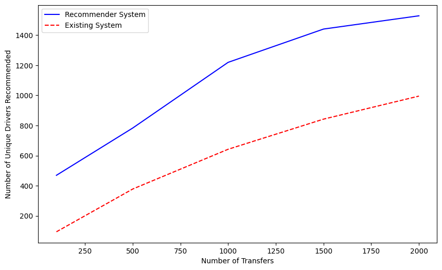
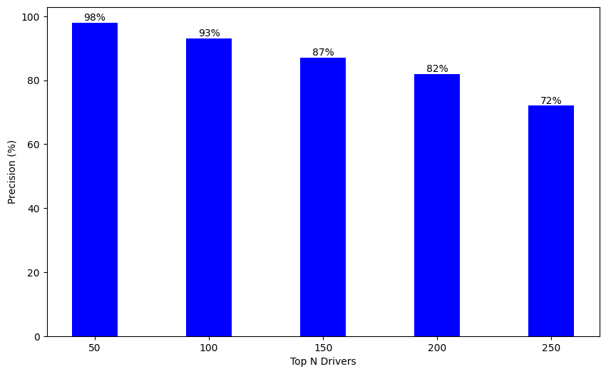
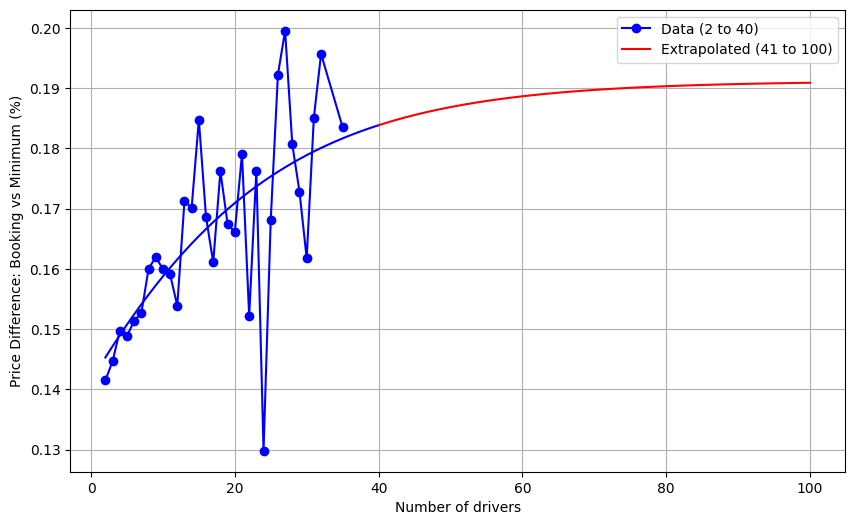

## Introduction

Vehicle transportation services face an increasingly complex logistics environment, with a growing need to move single vehicles across various destinations efficiently. Operating with a network of over 7,000 independent drivers, these services rely on drivers who are not direct employees but are integral to the system. A major challenge for these services is matching the right drivers to the right transportation requests while minimizing manual intervention.

---

## Problem Statement

Customers use the platform to post vehicle transfer requests, and drivers apply for these transfers. When the transfer date approaches without a driver assignment, manual intervention becomes necessary. This reliance on a limited pool of drivers has led to several issues:

- **Narrow Driver Pool**: The existing system focuses on high precision, limiting the driver pool. This reduces flexibility, increases operational costs, and grants disproportionate bargaining power to a small group of drivers.
- **Manual Processes**: As deadlines approach without an assigned driver, the process requires manual effort, which hinders scalability and efficiency.

---

## Achieved Results

We developed a two-tower recommender system that ranks drivers by their suitability for a given transfer. This system narrows the search space to approximately 100 drivers, around 2% of the original pool. The system ensures that in 93% of cases, unsuitable drivers are ranked beyond the top 100.

- **Engagement**: The recommender system doubled driver engagement, reaching 40% of drivers compared to the 20% in the previous system.
- **Cost Reduction**: By expanding the driver pool and increasing competition, costs are reduced by up to 19%. This is a significant improvement over the baseline 18% reduction.

---

### Figures:

#### Driver's Diversity vs. Number of Transfers

#### Precision at Different Recommendation Thresholds

#### Price Variation Analysis: Booking vs. Minimum (\%)

---

## Approach

The two-tower recommender system automates and optimizes the matching of drivers with vehicle transfer requests. This reduces the need for manual intervention and mitigates last-minute price adjustments. The system consists of two main components:

- **Driver Tower**: This component processes driver attributes and converts them into high-dimensional embeddings that represent their preferences.
- **Request Tower**: It processes transfer request details, such as pickup and drop-off locations, converting these into embeddings that represent the request’s characteristics.

The similarity between these embeddings is computed using cosine similarity, which ranks drivers based on their compatibility with the request.

This Markdown article contains the introduction, problem statement, achieved results, and approach sections. For the full details, a link is provided at the end. You can replace `#` in the link with the actual URL to the full paper.
