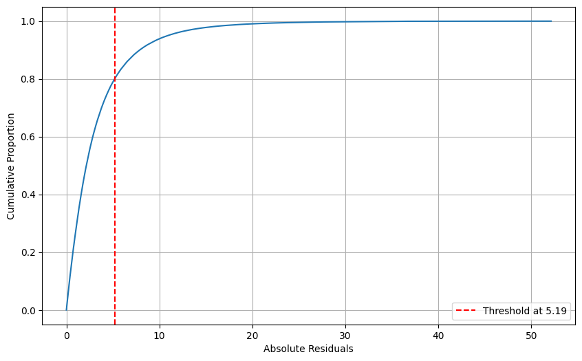
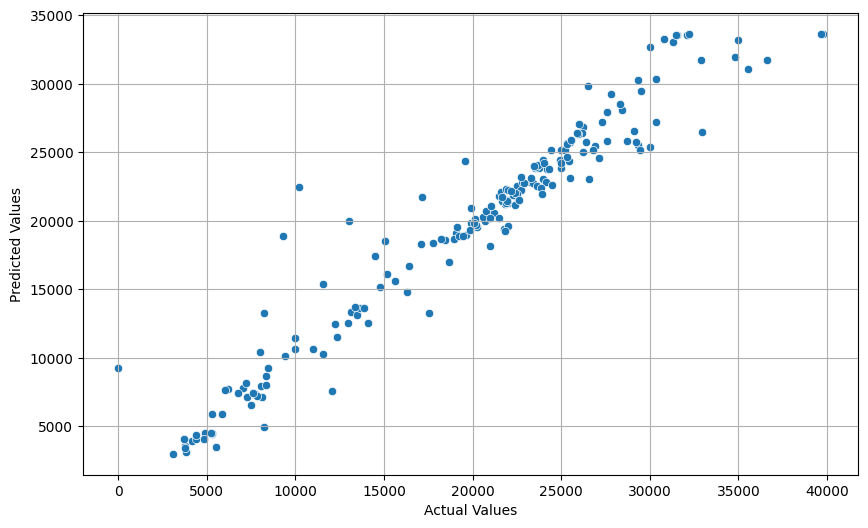
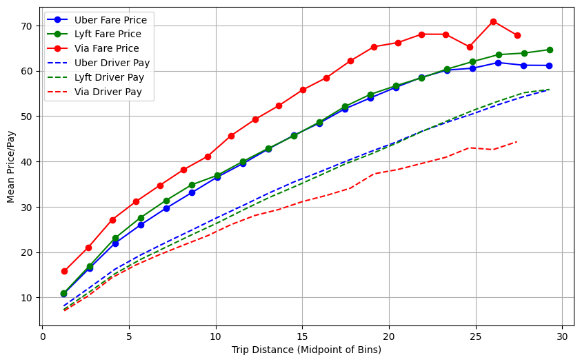
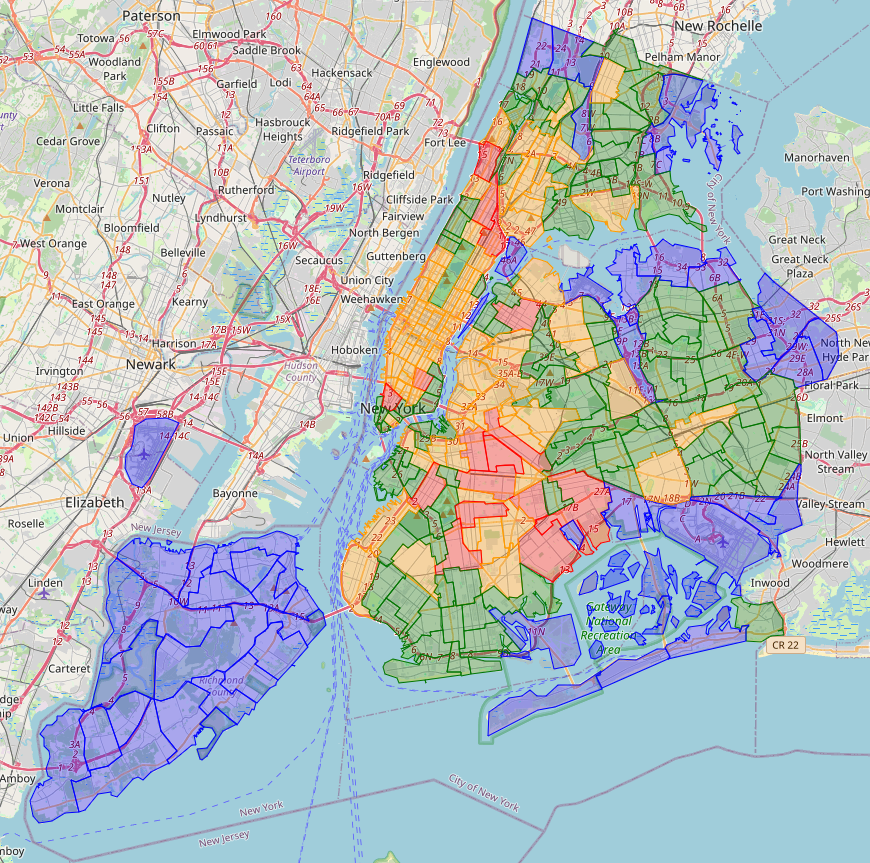

## Explanatory Video

Before diving into the details of this analysis, here’s a quick video overview explaining the key concepts and findings from the study on ride-hailing services in New York City:

<iframe width="560" height="315" src="https://www.youtube.com/embed/kRVfkAsUO8Y" frameborder="0" allow="accelerometer; autoplay; clipboard-write; encrypted-media; gyroscope; picture-in-picture" allowfullscreen></iframe>

---

## Introduction

Ride-hailing services such as Uber, Lyft, and Via have revolutionized transportation in urban environments, offering an efficient alternative to traditional taxis. In New York City (NYC), these platforms have become an integral part of the transportation ecosystem. The study focuses on trip records from the **Taxi and Limousine Commission (TLC)**, spanning from January to May 2021, to analyze fare pricing, demand trends, and geographical classifications across NYC's boroughs.

By using this data, we aim to:
- Analyze the factors affecting fare prices
- Predict demand surges
- Categorize NYC boroughs by their ride-hailing characteristics

---

## Problem Statement

Ride-hailing platforms face the challenge of predicting fare prices accurately and efficiently managing driver allocation, particularly in a city as diverse as NYC. Boroughs differ significantly in terms of demand, fare structures, and customer preferences, making it necessary to develop predictive models that address these variabilities.

To tackle this, the study proposes:
1. A **decision tree regressor** model to predict fare prices using features like trip distance, location, and time.
2. The **XGBoost algorithm** to forecast demand trends across the boroughs.

Through classification, the boroughs were grouped based on demand, price per mile, and waiting time to offer insights for better operational management.

---

## Approach

### Dataset Overview

We utilized the **Uber NYC For-Hire Vehicles Trip Data 2021** dataset, available on Kaggle. The dataset contains key details such as:
- Trip dates and times
- Pickup and drop-off locations
- Trip distances
- Fare prices

The dataset provides a solid foundation for analyzing ride-hailing dynamics in NYC, allowing us to perform detailed analysis on fare pricing and demand trends.

[Download the dataset here](https://www.kaggle.com/datasets/shuhengmo/uber-nyc-forhire-vehicles-trip-data-2021).

### Model Implementation

#### Fare Prediction Model

The **decision tree regressor** was used to predict fare prices based on factors like:
- Trip miles
- Pickup and drop-off locations
- Time of day

The model achieved an **R-squared value of 0.81**, explaining 81% of the variance in fare prices. This result demonstrates the model's accuracy in predicting fares based on the input variables.

#### Demand Forecasting Model

To forecast demand, the **XGBoost algorithm** was used, with features such as:
- Day of the week
- Hour of the day
- Trip history patterns

The model achieved an **R-squared value of 0.93**, indicating a high level of accuracy in predicting demand surges.

---

## Results

### Fare Prediction Results

The fare prediction model's performance was evaluated using actual and predicted values, demonstrating high accuracy in predicting fare prices. Below is a comparison of **actual vs. predicted fare prices**:

*Figure 1: CDF of Absolute Residuals for the Fare Price Prediction Model.*

Approximately 80% of the predictions have an error margin of -5.19 to 5.19, which showcases the model's precision.

### Demand Forecasting Results

Below is a graph comparing actual and predicted demand values, showcasing the model's forecasting accuracy:

*Figure 2: Actual vs. Predicted Values for the Forecasting Model.*

The model shows that it can accurately predict surges in demand, which is crucial for better resource allocation in ride-hailing services.

---

## Comparative Analysis Across Ride-Hailing Platforms

We compared operational metrics of **Uber, Lyft, and Via** across different distance bins, including:
- **Mean fare price**
- **Driver pay**
- **Waiting times**

*Figure 3: Mean Fare Price and Driver Pay Across Distance Intervals.*

Uber and Lyft are seen to offer higher driver compensation and lower fare prices compared to Via, which explains Uber’s market dominance.

---

## Borough Classification

The study also grouped NYC boroughs into four distinct clusters based on:
- Number of trips per pickup and drop-off locations
- Waiting times
- Price-to-mile ratio

*Figure 4: Map of New York City with Clusters.*

This clustering helps better understand the transportation dynamics in each borough and can guide strategic resource allocation.

---

## Conclusion

This study provided insights into ride-hailing services in NYC, with key takeaways including:
- Accurate fare price prediction using a decision tree regressor model.
- Reliable demand forecasting using XGBoost.
- Comparative analysis of ride-hailing platforms showing Uber's competitive edge.
- Borough classification offering actionable insights for resource management.

