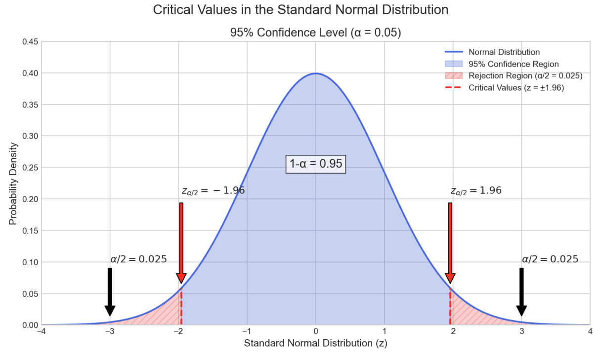

In this post, we’ll see why Cochran’s formula can **only** be derived for statistics based on the sample **mean**, and then show how the same logic gives the formula for **proportions**.

---

## 1. The Central Limit Theorem: Foundation of Statistical Inference

The **Central Limit Theorem (CLT)** states that if  
$$
X_1, X_2, \dots, X_m
$$  
are independent, identically distributed random variables with  
$$
E[X_i] = \mu,\quad \mathrm{Var}(X_i) = \sigma^2 < \infty,
$$  
then as \(m \to \infty\),  
$$
\sqrt{m}\,\bigl(\bar X_m - \mu\bigr)
  \;\xrightarrow{d}\; N(0,\,\sigma^2).
$$

**Key conditions**:  
- Finite mean \($\mu$\)  
- Bounded variance \($\sigma^2$\)  

---

## 2. Properties of the Normal Distribution and Critical Values

Let $Z \sim N(0,1)$.  For a confidence level $1 - \alpha$, define the **critical value** $z_{\alpha/2}$ by  
$$
P\bigl(Z > z_{\alpha/2}\bigr) = \frac{\alpha}{2}.
$$  
- For 95% confidence ($\alpha = 0.05$), $z_{0.025} = 1.96$.  
- Then  
  $$
  P\bigl(-z_{\alpha/2} < Z < z_{\alpha/2}\bigr) = 1 - \alpha.
  $$

---

## 3. From Sample Mean to Confidence Intervals

By the CLT,  
$$
\frac{\bar X - \mu}{\sigma/\sqrt{m}}
  \sim N(0,1),
$$  
so  
$$
P\!\Bigl(-z_{\alpha/2} < \tfrac{\bar X - \mu}{\sigma/\sqrt{m}} < z_{\alpha/2}\Bigr)
  = 1 - \alpha.
$$  
Rearrange to isolate \($\mu$\) :  
$$
P\!\Bigl(\bar X - z_{\alpha/2}\,\tfrac{\sigma}{\sqrt{m}} < \mu < \bar X + z_{\alpha/2}\,\tfrac{\sigma}{\sqrt{m}}\Bigr)
  = 1 - \alpha.
$$  

The **margin of error** is  
$$
E = z_{\alpha/2}\,\frac{\sigma}{\sqrt{m}}.
$$

---

## 4. Cochran’s Key Insight: Flipping the Perspective

Instead of computing the interval *after* sampling, Cochran asked:  
> **“How many samples do I need for a given \(E\)?”**  

Rearrange  
$$
E = z_{\alpha/2}\,\frac{\sigma}{\sqrt{m}}
$$  
to solve for **m**  :  
$$
m = \frac{(z_{\alpha/2})^2\,\sigma^2}{E^2}.
$$  

⚠️ **Note:** This derivation depends critically on the CLT for the sample mean, so only applies when your statistic is a mean (i.e. when you know or estimate \($\sigma^2$\) .

---

## 5. Cochran’s Formula for Estimating Proportions

The same logic applied to a Bernoulli variable \(X_i \in \{0,1\}\) with \(P(X_i = 1) = p\) yields the formula for proportions:

- **Sample proportion**:  
  $$
  \hat p = \frac{1}{m}\sum_{i=1}^m X_i.
  $$  
- **Moments**:  
  $$
  E[\hat p] = p,\quad \mathrm{Var}(\hat p) = \frac{p(1-p)}{m}.
  $$  
- **CLT** →  
  $$
  \frac{\hat p - p}{\sqrt{p(1-p)/m}}
    \sim N(0,1),
  $$  
  so  
  $$
  E = z_{\alpha/2}\,\sqrt{\frac{p(1-p)}{m}}
  \quad\Longrightarrow\quad
  m = \frac{p(1-p)\,(z_{\alpha/2})^2}{E^2}.
  $$  
- If \(p\) is unknown, set \(p = 0.5\) to maximize \(p(1-p)\) and obtain the most **conservative** (largest) sample size.

---

With these derivations in hand, you can choose your margin of error \(E\) and confidence level \(1-\alpha\) to compute exactly how many observations you need—whether you’re estimating a **mean** or a **proportion**.  

Want to dive deeper? You can download the full derivation as a PDF here:

[📄 Download the full paper (PDF)](./paper.pdf)